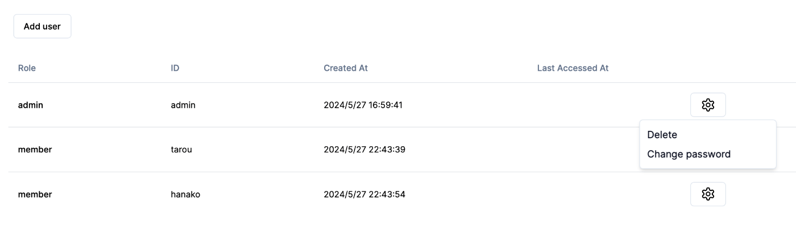
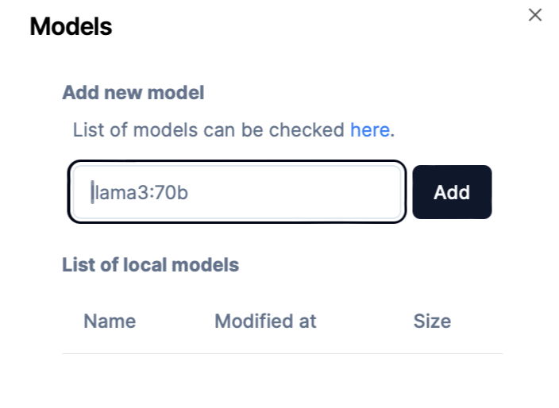
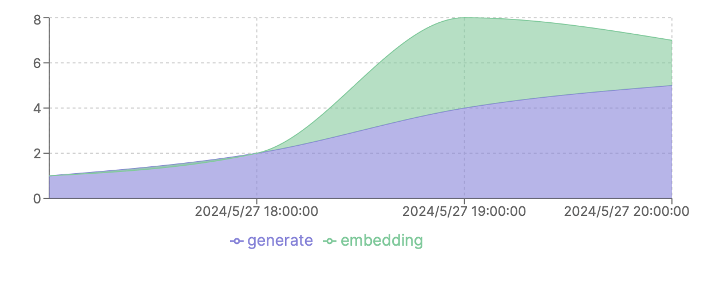

## Ollama4Team
Ollama4Team is a proxy for Ollama that provides

- Web interface
- Member management
- Authentication
- Usage statistics
- Model management

## Getting Started
### Clone this repository
```bash
git clone https://github.com/fjm2u/ollama4team.git
cd ollama4team
```

### Edit `.env` file
```bash
cp .env.example .env
vi .env
```

### Docker-compose up
#### CPU only mode
```bash
docker-compose -f docker-compose.cpu.yml up -d --build
```

#### Nvidia GPU
Install [Nvidia Container Toolkit](https://docs.nvidia.com/datacenter/cloud-native/container-toolkit/install-guide.html) and configure [docker](https://docs.nvidia.com/datacenter/cloud-native/container-toolkit/latest/install-guide.html#configuring-docker) to use Nvidia GPU.
Then,
```bash
docker-compose -f docker-compose.gpu.yml up -d --build
```

AMD GPU
```bash
docker-compose -f docker-compose.amd-gpu.yml up -d --build
```

3.Access to the web interface at `http://localhost:3000`


## Usage

### Panel
Users


Models


Usage statistics


### API
Generate
```bash
curl -X POST -H "Content-Type: application/json" -H "Authorization: Basic YOUR_PASSWORD" -d '{"model": "YOUR_MODEL", "prompt": "YOUR_PROMPT"}' "https://OLLAMA4TEAM_URL/api/generate"
```
Embedding
```bash
curl -X POST -H "Content-Type: application/json" -H "Authorization: Basic YOUR_PASSWORD" -d '{"model": "YOUR_MODEL", "prompt": "YOUR_PROMPT"}' "https://OLLAMA4TEAM_URL/api/embeddings"
```

With Langchain

Custom Classes are defined by [here](https://github.com/fjm2u/ollama4team_example).
Please star this project as we need your support to persuade LLM communities like Langchain to implement more user-friendly features.
```python
llm = Ollama4Team(model="llama3", password="password", base_url="http://localhost:3000")
for chunk in llm.stream("Write me a 1 verse song about sparkling water."):
    print(chunk, end="|", flush=True)

embeddings = Ollama4TeamEmbeddings(model="llama3", password="password", base_url="http://localhost:3000")
text = "This is a test document."
query_result = embeddings.embed_query(text)
print(query_result[:5])
```

## Contributing
PRs are welcome!
Please follow the [Contribution Guide](./CONTRIBUTING.md).
